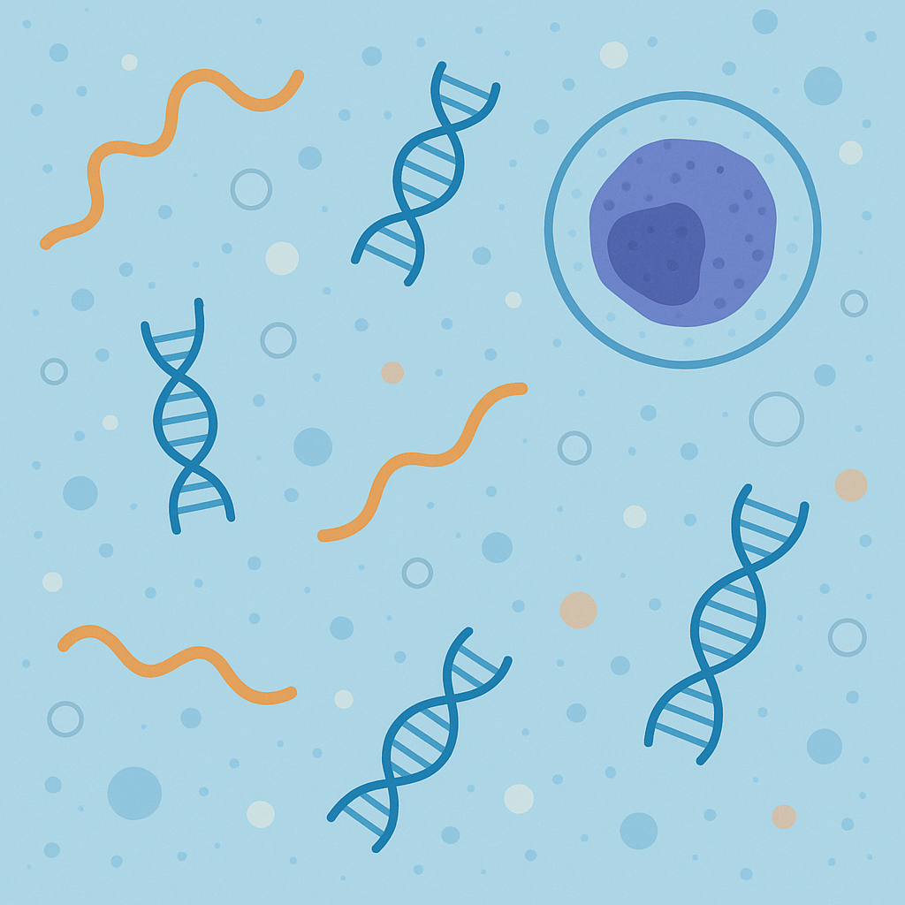

  

<nav>
  <a href="/">Home</a> |
  <a href="/about/">About</a> |
  <a href="/rnd/">R&D</a> |
  <a href="/contact/">Contact</a>
</nav>

# Blood test platform focused on non-invasive, sensitive, and specific detection of cancer-related biomarkers. 

We discover and develop non-invasive molecular tests based on nucleic acid analytes.

     
  

  

  
© 2025 double-strand LLC. All rights reserved.

  

    <a href="/contact" style="color: #1e90ff; text-decoration: none; margin: 0 10px;">Contact</a> |
    <a href="/privacy_policy" style="color: #1e90ff; text-decoration: none; margin: 0 10px;">Privacy Policy</a>
  

  This site uses cookies for Google Analytics.  
  <button onclick="acceptCookies()" style="margin-left:10px;">Accept</button>
  <button onclick="denyCookies()" style="margin-left:10px;">Deny</button>

